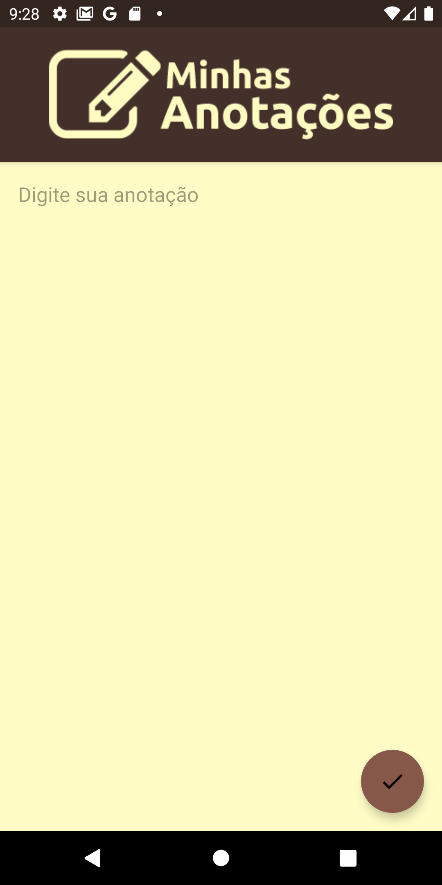

## An android app example of how to save text by SharedPreferences

* Android ConstraintLayout
* Android MediaPlayer

### Reference
* https://developer.android.com/training/data-storage/shared-preferences#java
